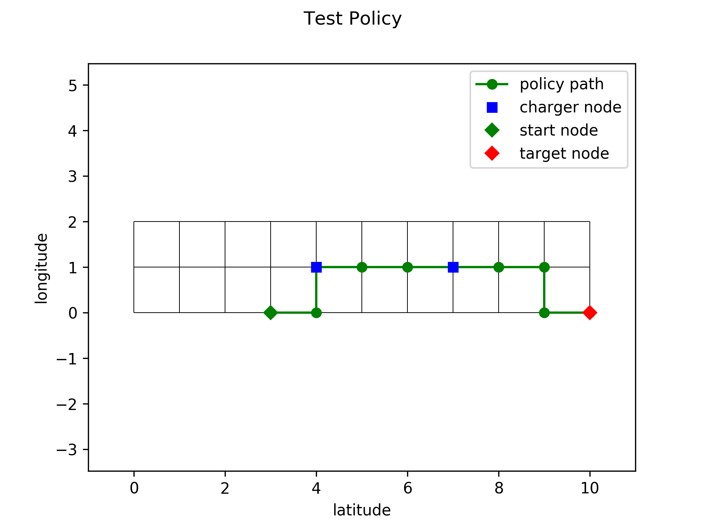

# RoadNetworkValueIteration

## Requirements

* System Requirements: Ubuntu 21.04

```bash
sudo apt-get install libblas-dev liblapack-dev
```

* Python requirements

``` bash
pip3 install -r requirements.txt
```

## Used Libraries

| Link                                       | Author | Description                                      |
| ------------------------------------------ | ------ | ------------------------------------------------ |
| [libnpy](https://github.com/llohse/libnpy) | llohse | C++ library for reading and writing of npy files |
| [eigen](https://github.com/libigl/eigen)   | libigl | C++ library for linear algebra                   |

## Parameters

| Link                       | Description                                                          |
| -------------------------- | -------------------------------------------------------------------- |
| [Makefile](Makefile#L0-L4) | General directory and compilation parameters                         |
| [Config](config.yaml)      | Usage parameters for generating, evaluating, and testing the project |

## Usage

* Build C++ backend

``` bash
make compile
```

* Generate Markov Decision Process

``` bash
make generate
```

* Generate and test the policy: If the policy has been created and not been cleared, it is not generated again at consecutive calls.

``` bash
make evaluate
```

* Clear local `DATA_OUT` folder

``` bash
make clean_data
```

## Examples

### Small Arena


