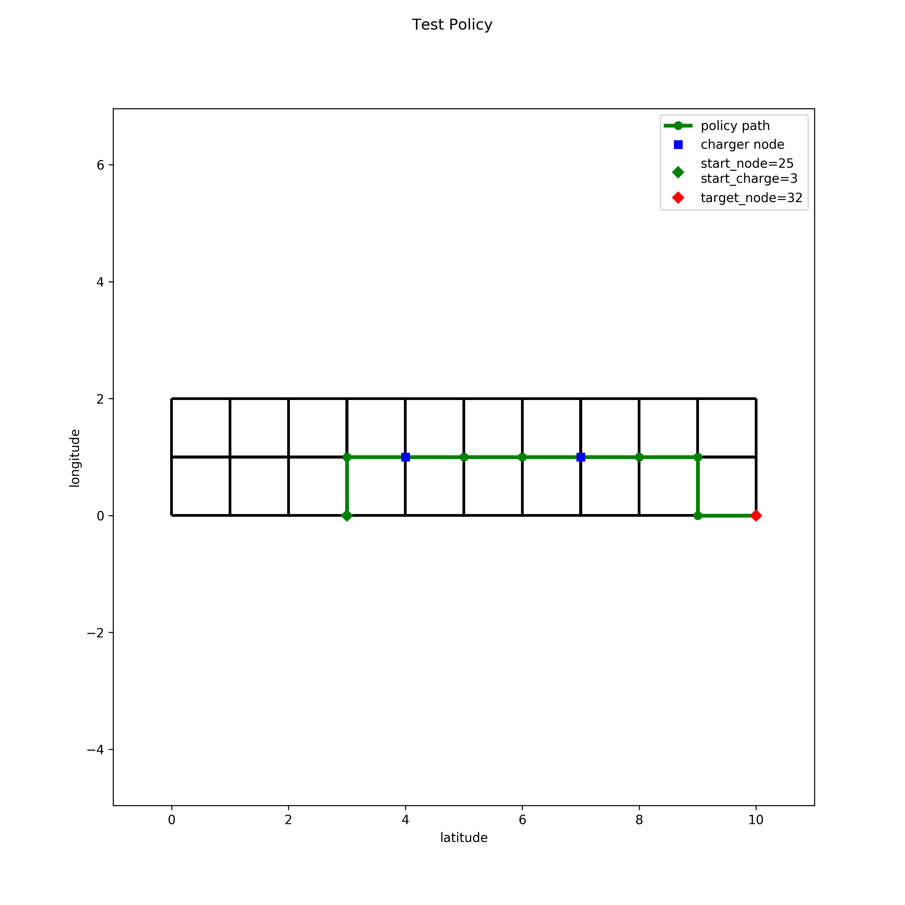

# RoadNetworkValueIteration

This project is a demonstration for generating and evaluating Markov decision processes for road networks, where a vehicle carries charge/fuel that is spent while driving. A policy is generated using asynchronous value iteration utilizing the OpenMP C++ library for multithreaded evaluation.  The policy is generated with custom stage cost to change the behavior of travelling to charging stations for refueling. Furthermore, this project combines Python in the front-end and C++ in the back-end for optimal performance. 

Overall, this project is only meant as inspiration and study-tool for performance oriented programming and value iteration, as it is used for this purpose only.

## Requirements

* System Requirements: Ubuntu 20.04.4 LTS

```bash
sudo apt update
sudo apt install -y build-essential cmake libblas-dev liblapack-dev liblapacke-dev libomp-dev
```

* Python requirements

``` bash
pip3 install -r requirements.txt
```

## Used Libraries

| Link                                       | Author | Description                                      |
| ------------------------------------------ | ------ | ------------------------------------------------ |
| [libnpy](https://github.com/llohse/libnpy) | llohse | C++ library for reading and writing of npy files |
| [eigen](https://github.com/libigl/eigen)   | libigl | C++ library for linear algebra                   |

## Parameters

| Link                       | Description                                                          |
| -------------------------- | -------------------------------------------------------------------- |
| [Makefile](Makefile#L0-L4) | General directory and compilation parameters                         |
| [Config](config.yaml)      | Usage parameters for generating, evaluating, and testing the project |

## Usage

* Build C++ backend

``` bash
make compile
```

* Generate Markov Decision Process

``` bash
make generate cfg={config}
```

* Generate and test the policy: If the policy has been created and not been cleared, it is not generated again at consecutive calls.

``` bash
make evaluate cfg={config}
```

* Clear local `DATA_OUT` folder

``` bash
make clean_data
```

## Examples

### Small Arena

``` bash
make compile
make generate cfg=config_data_1.yaml
make evaluate cfg=config_data_1.yaml
``` 



### California Road Network

``` bash
make compile
make generate cfg=config_data_2.yaml
make evaluate cfg=config_data_2.yaml
``` 


